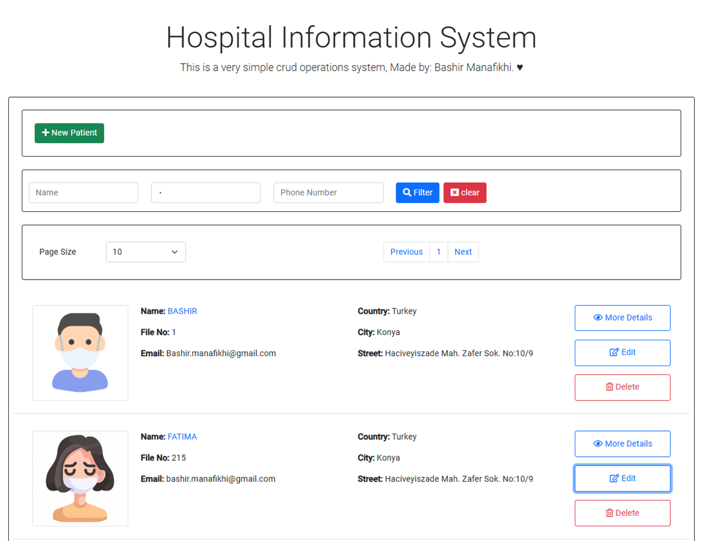
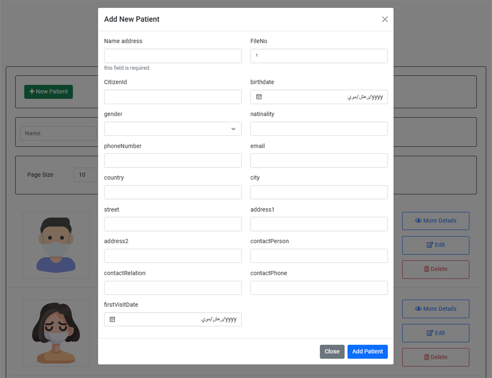
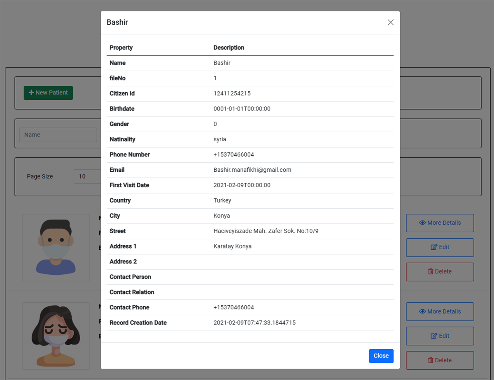
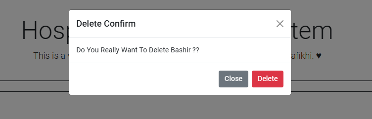

# Hospital Information System
## Overview

This project is a Hospital Information System built with .NET Core for the backend API and Angular for the frontend. It facilitates CRUD (Create, Read, Update, Delete) operations for patient records. The system includes pagination and advanced filtering options for searching patients by name, file number, phone number, or a combination of these criteria.

This project was developed in early *2021*

### Features

- **CRUD Operations:** Allows adding, updating, and deleting patient records.
- **Pagination:** Users can navigate through pages and set the page size.
- **Advanced Filtering:** Search patients by name, file number, or phone number.
- **Beautiful UI:** The frontend is designed with Angular, offering a visually appealing user experience.
- **Alerts:** Displays attractive alerts, enhancing user interaction.

## Backend API (ASP.NET Core)

### Endpoints

- **GET /patients**: Retrieves a list of patients with pagination and filtering options.
- **GET /patients/{id}**: Retrieves a specific patient by ID.
- **POST /patients**: Adds a new patient record.
- **PUT /patients/{id}**: Updates an existing patient record.
- **DELETE /patients/{id}**: Deletes a patient record by ID.

## Frontend (Angular)

The Angular frontend provides a user-friendly interface for interacting with the Hospital Information System. It allows users to view patient records, add new patients, and delete existing ones.

### Screenshots

*Figure 1: Patients List Page*

*Figure 2: Add Patient Form*

*Figure 3: Patient Details*

*Figure 3: Patient Delete Alert*

## Installation

### Prerequisites

- Node.js
- Angular CLI
- .NET Core SDK

### Steps

1. Clone the repository: `git clone https://github.com/bashirmanafikhi/Hospital-Information-System.git`
2. Navigate to the backend directory: `cd Hospital Information System API`
3. Restore dependencies: `dotnet restore`
4. Run the backend server: `dotnet run`
5. Navigate to the frontend directory: `cd Hospital Information System UI`
6. Install dependencies: `npm install`
7. Run the frontend server: `ng serve`

